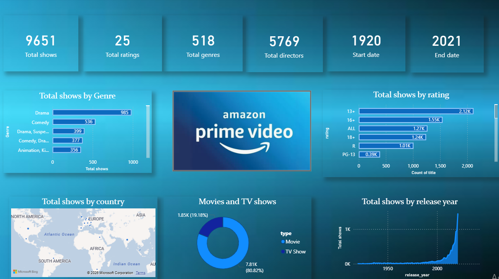

# 📺 Amazon Prime Video Analysis Dashboard – Power BI Project

## 📌 Project Overview

This project presents an **interactive Power BI dashboard analyzing Amazon Prime Video content**. The dashboard provides insights into **movies and TV shows, genres, ratings, countries, and release trends** available on the platform.

The aim of this project is to transform raw data into **interactive visual insights that help understand streaming platform content distribution and trends**.

---

# 📊 Dashboard Preview

---

# 🛠 Tools & Technologies

* Power BI
* Data Visualization
* Data Modeling
* DAX (Data Analysis Expressions)
* Business Intelligence

---

# 📈 Key Metrics

The dashboard provides important summary statistics of the Amazon Prime content library:

* **Total Shows:** 9651
* **Total Ratings:** 25
* **Total Genres:** 518
* **Total Directors:** 5769
* **Start Year:** 1920
* **End Year:** 2021

---

# 🎬 Genre Distribution

The dashboard shows the **distribution of shows across different genres**.

Insights include:

* Drama has the highest number of shows
* Comedy and drama combinations are common
* Animation and kids content have smaller representation

---

# ⭐ Rating Distribution

The visualization shows how shows are distributed across **different content ratings**.

Key Observations:

* **13+ and 16+ ratings dominate the platform**
* Mature content is widely available
* Family-friendly ratings like **PG-13 appear less frequently**

---

# 🌍 Shows by Country

The map visualization highlights **content production across different countries**.

Insights include:

* North America contributes a large portion of content
* Content production is distributed globally

---

# 🎥 Movies vs TV Shows

The donut chart compares the share of **movies vs TV shows**.

Key Findings:

* Movies dominate the content catalog
* TV shows represent a smaller percentage of the platform

---

# 📅 Release Year Trends

The line chart shows **how the number of shows has grown over time**.

Key Insights:

* Content production increased significantly after 2000
* Streaming platforms have rapidly increased content releases in recent years

---

# 🎯 Conclusion

This Power BI dashboard demonstrates how **data visualization can help analyze streaming platform datasets and discover content trends**. The dashboard provides insights into **content distribution, genre popularity, and release patterns**.

---

# 📬 Contact

**Deepti Suresh**
Aspiring Data Analyst

📧 [deeptisuresh05@gmail.com](mailto:deeptisuresh05@gmail.com)

---

If you want, I can also give you a **🔥 powerful GitHub README template for all your projects (Sales + Amazon + HR + IPL)** so your **GitHub becomes a full Data Analyst portfolio**.
